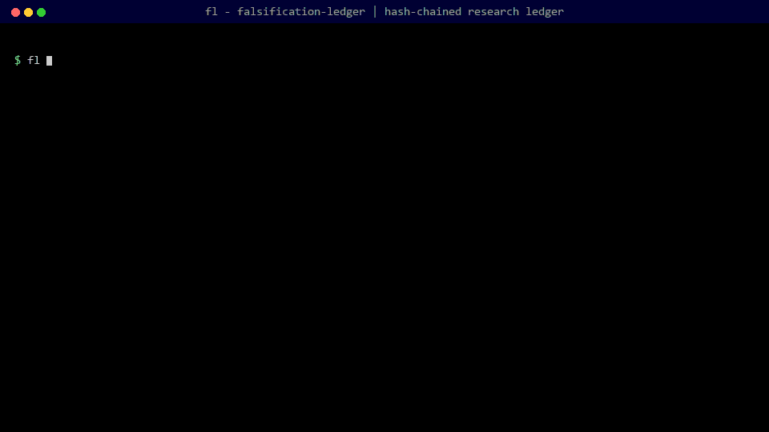
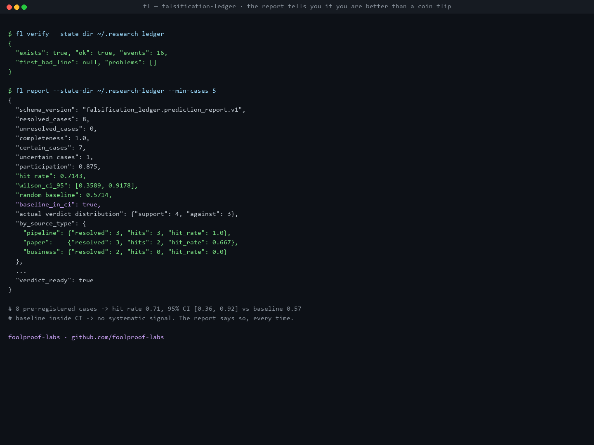

# falsification-ledger


> 收录于 [awesome-quant](https://github.com/wilsonfreitas/awesome-quant) —— 量化库精选清单（Trading & Backtesting 板块）。

## 中文说明

`falsification-ledger` 是量化研究的可验证实验记录本，也适用于 A 股回测。
研究开始前先登记假设，以及什么证据会推翻它；之后把证据写入追加式、
哈希串联的记录，再进行一次性裁决和命中率统计。它帮助减少事后挑选结果，
但不替代数据审计、统计检验或人工判断。

这是一个哈希链式、只追加（append-only）的研究主张记录本：**在研究运行
*之前*预先注册（pre-register）假设，以及会推翻它的证据**，然后诚实裁决，
并将你的命中率与随机基线进行对比。要求 Python 3.11+，仅一个依赖
（`jsonschema`），支持 Windows / Linux / macOS。

**状态：** v0.1.1 alpha，已发布到 PyPI。记录本的语义提炼自一套生产级研究
管线（pipeline），但这个独立包是新的：在 v1.0 之前，CLI 和 schema 预计
还会变动。

## 为什么会有这个项目

量化研究存在一个自欺欺人的问题：你测试了 500 个因子想法，记住了其中有效
的 3 个，却忘了死掉的 497 个。等到你"验证"那些侥幸存活的因子时，证据
已经被你看到的结果污染了。市面上每个回测卫生（backtest-hygiene）工具都在
对付这个问题的*统计*层面（缩水夏普比率 deflated Sharpe、PBO、多重检验
校正）。`falsification-ledger` 对付的是*流程*层面：它迫使你在看到证据之前
写下：

- 你期望什么（`support` 支持 / `against` 反对 / `uncertain` 不确定），以及
- 什么证据会**推翻**你的主张（证伪契约 falsification contract）。

然后它保存凭证。每个事件都落入一条只追加的 JSONL **哈希链**——事后任何
修改都会被 `fl verify` 检测出来——而报告只回答唯一重要的问题：*你预先注册
的信念是否真的命中，还是你的命中率与随机基线无法区分？*（Wilson 95% 置信
区间对比最常见的实际裁决。）

## 设计理念

**研究是一项承诺；记录本负责兑现。**

- **可证伪性是默认要求，而非例外。** 波普尔（Popper）的判据——只有当某事
  可能对主张构成反驳时，该主张才是科学的——通常只是被当作说教提及。在
  这里，它是一个必填的 JSON 字段（`preregister` 上的
  `falsification_contract`）。
- **预先分析计划（pre-analysis plan）的代价与收益都是已知的。** [Olken
  (2015)，《预先分析计划的承诺与风险》（Promises and Perils of Pre-Analysis
  Plans）](https://www.aeaweb.org/articles?id=10.1257/jep.29.3.61)
  （JEP 29(3)）对两者都有论述；本工具实现其收益（冻结的预期、审计轨迹
  audit trail），同时让代价保持显式（`uncertain` 裁决和探索性 source type
  是一等公民，因此你可以登记自己确实不知道的内容）。
- **适度优于彻底冻结。** [Banerjee & Duflo，《赞美适度》（In Praise of
  Moderation）](https://www.semanticscholar.org/paper/05ecf99a05419f0a268fe885be11a2cf4a8dbd46)
  主张分层预先注册；`source_type`（paper 论文 / business 业务 /
  cross_domain 跨领域 / pipeline 管线 / other 其他）的存在使得确证性
  （confirmatory）与探索性（exploratory）主张永远不会混在同一桶里。
- **金融可以变得科学。** [López de Prado (2023)，《因果因子投资》（Causal
  Factor Investing）](https://www.cambridge.org/core/elements/causal-factor-investing/9AFE270D7099B787B8FD4F4CBADE0C6E)
  追问因子投资能否成为一门科学；这个记录本就是其中一个具体的回答——带有
  保管链（chain of custody）的证据，对照预先注册的预期进行裁决。
- **自动化研究需要机器可校验的证据。** [EviBound（arXiv:2511.05524）](https://ar5iv.labs.arxiv.org/html/2511.05524)
  和 [ECLIPSE v2.0](https://ideas.repec.org/p/osf/metaar/z3fke_v1.html)
  主张智能体研究管线（agentic research pipeline）必须通过可验证的证据消除
  虚假主张；`fl submit` 会依据 JSON Schema 校验证伪报告并计算内容 ID，
  因此关卡（gate）可以信任证据本身而不必信任提交者。

## 实际效果演示

`fl verify` 捕捉到一次事后修改——每个事件都是哈希链的一环，改动一个字段
就会在特定行号处破坏整条链：



报告则直言不讳。在一个真实的 8 案例演示记录本上，`fl report` 回答唯一重要
的问题——*你是否比抛硬币更好？*：



完整 JSON：[docs/report-example.txt](docs/report-example.txt)——命中率 0.71，
95% Wilson 置信区间为 [0.36, 0.92]，而随机基线为 0.57：**基线落在置信区间
内，因此报告给出的结论是"不存在系统性信号"——并且拒绝假装不是这样。**

## 快速开始

```bash
# install the published package from PyPI
pip install falsification-ledger

# or run without installing anything:
#   PYTHONPATH=src python -m falsification_ledger --help

# try the full loop on a scratch ledger (creates files under a temp dir)
python examples/demo.py
```

手动走一遍完整流程：

```bash
fl init --state-dir ~/.research-ledger

# 1. BEFORE running the study: register what you expect,
#    and what evidence would kill the claim.
fl preregister --state-dir ~/.research-ledger \
  --case-id MOMENTUM-OOS-2026Q3 \
  --verdict support \
  --reason "momentum rank IC stays positive OOS" \
  --source-type paper \
  --contract kill-criteria.json

# 2. When an independent check produces evidence, submit it:
fl submit --report falsification-report.json
# -> {"content_id": "sha256:...", "evidence_status": "valid", ...}

# 3. AFTER the study: adjudicate honestly.
fl adjudicate --state-dir ~/.research-ledger \
  --case-id MOMENTUM-OOS-2026Q3 --verdict support

# 4. Measure whether you are better than a coin flip.
fl report --state-dir ~/.research-ledger --min-cases 20

# 5. Any time: prove nobody rewrote history.
fl verify --state-dir ~/.research-ledger
```

## 命令

| 命令 | 作用 |
| --- | --- |
| `init` | 创建记录本状态目录 |
| `preregister` | 登记一项主张：`--case-id`、`--verdict`（support 支持 / against 反对 / uncertain 不确定）、`--reason`，可选 `--source-type`，可选 `--contract`（证伪契约 JSON）。同一 case 的重复登记会被拒绝 |
| `submit` | 依据契约 schema 校验证伪报告；打印其内容 ID（`sha256:...`）和证据状态（`valid` 有效 / `invalid` 无效 / `missing` 缺失）。只读操作；遇到阻塞项时以非零退出码退出 |
| `adjudicate` | 为已登记的 case 补记实际裁决（必须先登记；每个 case 只能一次） |
| `report` | 命中率报告：已裁决的 case 数、完整性、参与度、带 **Wilson 95% 置信区间** 的命中率、随机基线、按 source type 的细分、`verdict_ready` 关卡 |
| `verify` | 重新计算整个记录本的哈希链；检测任何修改、插入或重排 |
| `version` | 打印版本号 |

全局标志：每个有状态的命令都支持 `--state-dir`（默认：无——记录本路径始终
是显式指定的，因此 `git add .` 永远不会把它扫进版本控制）。

## 记录本格式

记录本是一个位于 `<state-dir>/ledger.jsonl` 的 JSONL 文件。每一行是一个
事件：

```json
{"schema_version": "falsification_ledger.prediction_event.v1",
 "event": "register", "record_id": "...", "case_id": "CASE-1",
 "expected_verdict": "support", "expected_reason": "...",
 "source_type": "paper", "falsification_contract": {...},
 "actual_verdict": null, "recorded_at": "...", "concluded_at": null,
 "prev_hash": null,
 "event_hash": "sha256(prev_hash || 0x00 || canonical payload)"}
```

`verify` 会重新计算每一个 `event_hash` 并检查每一条 `prev_hash` 链接。
**任何篡改——修改理由、删除一行、重排事件——都会在特定的行号处破坏整条链。**

## 证伪报告

证伪报告（falsification report）是由独立检查（零模型随机化 null-model
randomization、样本外秩 IC OOS rank IC、FDR 校正、方案偏离 protocol
deviation、效应置信区间 effect CI、成本敏感性 cost sensitivity……）产生的
机器可读证据。其契约如下：

- schema：[`schema/falsification-report.schema.json`](https://github.com/holdout-labs/falsification-ledger/blob/main/schema/falsification-report.schema.json)
  （draft 2020-12，`additionalProperties: false`，默认拒绝 fail-closed）；
- 内容 ID：对 `domain-prefix || 0x00 || canonical JSON` 计算 `sha256:`——
  同一份报告总是得到相同的 ID，改动一个字段就会得到不同的 ID；
- 证据状态（对关卡默认拒绝 fail-closed）：
  - `valid` 有效——符合规范，结论为 `not_falsified`（未被证伪），一致性完好；
  - `invalid` 无效——不符合规范，或结论为 `falsified`（已被证伪），或明确不一致；
  - `missing` 缺失——结论为 `inconclusive`（无定论）：视为*不存在*的证据。

## 验证模型

`fl verify` 是防篡改证据层：它从文件字节重新推导整条链，并报告第一个出错
的行。结合 `preregister`（冻结的预期）和 `submit`（内容寻址的证据
content-addressed evidence），研究管线可以向自己——以及审阅者——证明预期
先于证据存在。这里的一切都不涉及交易、定价或决策。

## 开发

```bash
python -m pip install -e . pytest
python -m pytest
```

CI 会在 Ubuntu、Windows 和 macOS 上以 Python 3.11 和 3.12 运行完整测试套件。
问题（issue）在周末处理；欢迎提交 pull request。

## 相关文献

- [Olken (2015)，Promises and Perils of Pre-Analysis Plans](https://www.aeaweb.org/articles?id=10.1257/jep.29.3.61) ——冻结预期的经济学
- [Banerjee & Duflo，In Praise of Moderation](https://www.semanticscholar.org/paper/05ecf99a05419f0a268fe885be11a2cf4a8dbd46) ——分层预先注册
- [López de Prado (2023)，Causal Factor Investing](https://www.cambridge.org/core/elements/causal-factor-investing/9AFE270D7099B787B8FD4F4CBADE0C6E) ——因子投资能否变得科学？
- [EviBound: Evidence-Bound Autonomous Research（arXiv:2511.05524）](https://ar5iv.labs.arxiv.org/html/2511.05524) ——智能体研究的治理
- [ECLIPSE v2.0: A Systematic Falsification Framework](https://ideas.repec.org/p/osf/metaar/z3fke_v1.html) ——强制执行可证伪性完整性

## 项目家族

属于 [Holdout](https://github.com/holdout-labs) 的一部分——一个对抗量化研究
中自欺欺人的工具链：

- [pit-adjuster](https://github.com/holdout-labs/pit-adjuster) ——带静态前复权漂移检测的 PIT（point-in-time，时点）后复权
- [falsification-ledger](https://github.com/holdout-labs/falsification-ledger) ——预先注册与证伪记录本
- [factor-qc](https://github.com/holdout-labs/factor-qc) ——默认拒绝的回测质量关卡
- [lesson-book](https://github.com/holdout-labs/lesson-book) ——交易者的学费记忆
- [lookahead-free](https://github.com/holdout-labs/lookahead-free) ——可验证的无前视（look-ahead）检查
- [ashare-data-immunity](https://github.com/holdout-labs/ashare-data-immunity) ——A 股日线数据免疫

姊妹组织：[Metabolism Tools](https://github.com/metabolism-tools) ——
[`workspace-metabolism`](https://github.com/metabolism-tools/workspace-metabolism)，
为智能体工作区提供策略驱动的文件生命周期管理。

## 许可证

MIT
